**English** | [简体中文](README.zh-CN.md)

<div align="center">

# MemoryGuard

**Bounded active memory maintenance for long-horizon embodied agents**

[](https://github.com/Jxy-yxJ/MemoryGuard/actions/workflows/tests.yml)
[](LICENSE)
[](requirements.txt)

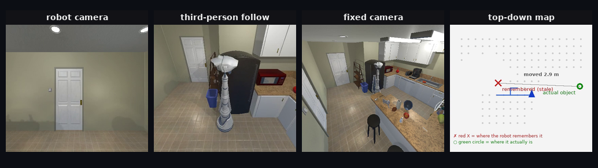

<sub><b>Real simulator frames</b> (FloorPlan5 / Knife / seed 163): robot camera · third-person follow · fixed room camera · top-down map with the remembered (red X) and true (green) locations. The full paired demo is below.</sub>

[Project page](https://jxy-yxj.github.io/MemoryGuard/) · [Results](#results) · [Demo](#demo) · [Reproduce](#reproducing) · [简体中文](README.zh-CN.md)

</div>

Xinyu Jiang ([@Jxy-yxJ](https://github.com/Jxy-yxJ)) · [Code](https://github.com/Jxy-yxJ/MemoryGuard)


MemoryGuard studies a concrete failure mode of long-horizon embodied memory: a remembered
object location silently becomes *stale* after the environment changes, and a downstream task
then fails because it acts on the outdated memory. Instead of storing memory and hoping it stays
valid, MemoryGuard treats memory as something that must be **actively maintained under a bounded
budget**: before acting, it decides whether a memory is worth verifying, verifies it with a
grounded perception/detector signal, refreshes the memory when it is stale, and only then executes
the downstream action.

The loop is a simple three-stage mechanism:

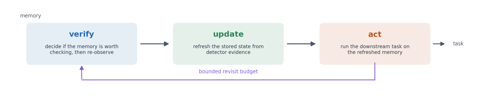

The verification stage is **detector-agnostic**: any staleness signal (an oracle-metadata proxy
in replay, a Grounded-SAM2 detector in live runs, or a vision-language model) can be plugged in.
A key finding is that reliable staleness *detection* is not the same as reliable memory
*maintenance*: a strong vision-language model detects staleness in 6/6 cases yet makes the correct
update decision in only 3/6.

## How it works

MemoryGuard keeps an object memory of `(class, pose)` records and runs a bounded
**verify → update → act** loop over it.

**1. Score — which memories are worth verifying.**
Before any observation, each memory receives an expected-verification-value score from cheap
signals: whether the target was visible on the last revisit, its distance from the remembered
pose, and a per-class visual-confusion indicator (for visually confusable classes such as Book,
Newspaper and Pencil). Under a verification budget `B`, the top-`B` memories are selected. The
score is deliberately simple and auditable so that the mechanism evidence is not confounded by a
learned ranker; the loop is signal-agnostic and any `P(stale)` estimator — including a VLM-based
one — can replace it.

**2. Verify — perception-backed staleness detection.**
A stepwise controller navigates to the remembered pose (no `TeleportFull` on measured paths) and
captures the live RGB frame. An open-vocabulary detector — Grounding DINO + SAM 2 ("GSAM") —
decides whether the remembered object is still there and, if stale, returns a detection-grounded
candidate location. Oracle simulator metadata is used **only** for offline labels and case
construction, never as a policy input.

**3. Update — detector-backed memory refresh.**
When the verifier marks a memory stale, the record is refreshed in place from the detector
evidence. Each update stores the old position, the new position, the verifier confidence, and a
machine-readable update-source string, so every memory mutation is traceable.

**4. Act — guarded, honest task execution.**
The agent navigates to the refreshed location and attempts the downstream action
(`PickupObject`). Interaction is *honest*: `forceAction=False` so the simulator enforces proximity
and visibility, a yaw-corrected face-then-pick step, a camera-horizon sweep (down 60°, up 30°),
and a bounded approach fallback over up to three nearby reachable poses when the target is not
visible from the first pose.

**Auditability.** Every row records whether the verifier was used, the stale decision, whether
memory was mutated, the measured revisit/task paths, `TeleportFull`/`TeleportObject` flags, and a
failure reason, so claims can be traced back to individual decisions.

### Evaluation protocol

Claims are tested with a **paired** design rather than aggregate success rates. Cases are
pre-registered and passed through an outcome-free geometry screen (the stale remembered location
is at least 2 m from the true object and the refreshed location within 1.5 m, the target is
pickupable, and same-type pairing is unambiguous). Active and passive arms then run the **same
frozen cases**, the same scene/seed/spawn, the same stepwise navigation, and the same honest
interaction; the passive arm acts from the stale location with no verifier and no memory mutation.
We report exact counts, McNemar exact tests, and Clopper-Pearson intervals, and replicate on
held-out scenes, target classes, and seeds.

---

## Contributions

- **Problem framing.** Treats stale object memory as a *bounded active-maintenance* problem —
  deciding which memories to verify under a limited sensing and navigation budget — instead of
  passive replay detection or oracle-metadata verification.
- **A detector-agnostic verify–update–act loop** with a bounded budget and row-level
  auditability, driven by a deliberately simple pre-verification ranking signal that any learned
  `P(stale)` estimator can replace.
- **An honest-interaction paired evaluation protocol.** Pre-registered, geometry-screened, paired
  active-vs-passive challenges with frozen case lists, exact statistics, and held-out replication —
  including the diagnosis and fix of the facing-angle failure that the first honest run exposed.
- **Empirical findings.** (i) Perception-backed active maintenance discriminates from stale
  passive execution (29/32 vs 0/34; replicated at 11/11 and 22/24 on unseen cases); (ii) budgeted
  ranking cuts selected strict detector false negatives from 6 to 1 on the FN-prone protocol;
  (iii) strong vision-language models detect staleness (6/6) but fail maintenance (3/6 correct
  updates, 0/6 full chains) — detection is not maintenance; (iv) same-type instance confusion is
  the dominant verifier error mode (8/8 false negatives) and is live-run sensitive.
- **Open artifacts.** Pre-registrations, frozen case lists, per-row run outputs, analysis code and
  statistics, and demo videos are all included in this repository.

---

## Demo

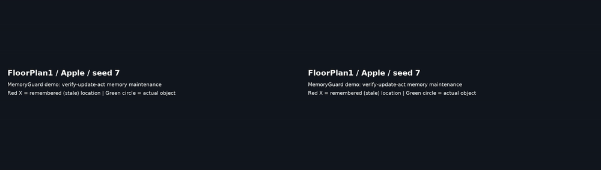

*Top: MemoryGuard verifies the memory, detects that it is stale, refreshes it, navigates to the
object's new location (green circle), and picks it up. Bottom: a passive agent acting on stale
memory arrives at the remembered location (red X) and finds nothing. Each side shows four
synchronised views — the robot's camera, a third-person follow view, a fixed room camera, and a
top-down map with the remembered location (red X), the true object location (green circle), and the
agent's path — plus a loop-stage progress bar and a verifier-decision card at the moment of
verification. Full-resolution clips are in [`videos/`](videos/).*

Phase 3 adds the reliability story as a paired demo: the
[failure mode](videos/m2_reliability_Box_163_baseline.mp4) (single-view "fresh" verdict on a
moved Box — no action, task fails) and the
[recovery](videos/m2_reliability_Box_163_active.mp4) (second-pose re-observation flips the
verdict to stale; memory refreshed; Box picked up). Both clips use the same four synchronised
views (robot camera, third-person follow, fixed room camera, top-down map), hold each step for ~half a second so the
turns are easy to follow, and end with an on-map "Box in hand" marker when the pickup succeeds.

<p align="center"><b>More clips</b> — poster frames link to the MP4s (four synchronised views, loop-stage bar, and decision card):</p>
<p align="center">
  <a href="videos/FloorPlan1_Apple_7_active.mp4">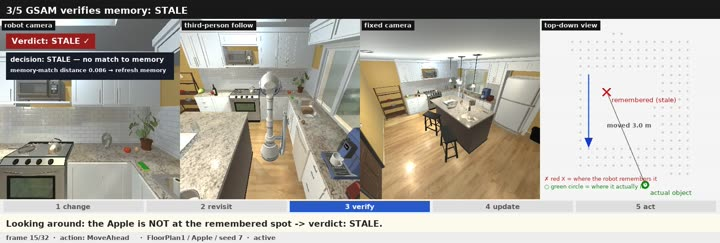</a>
  <a href="videos/FloorPlan1_Apple_7_passive.mp4">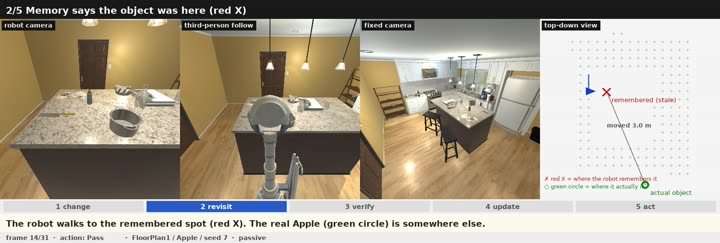</a>
</p>
<p align="center">
  <a href="videos/FloorPlan5_Knife_163_active.mp4">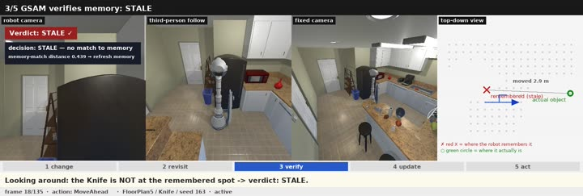</a>
  <a href="videos/FloorPlan6_Tomato_139_active.mp4">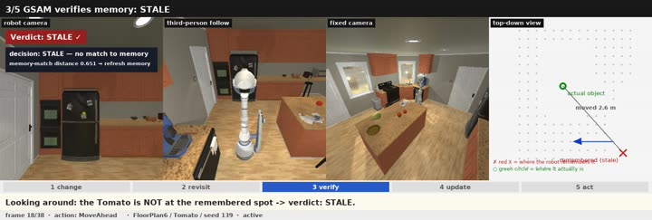</a>
</p>
<p align="center">
  <a href="videos/m2_reliability_Box_163_active.mp4">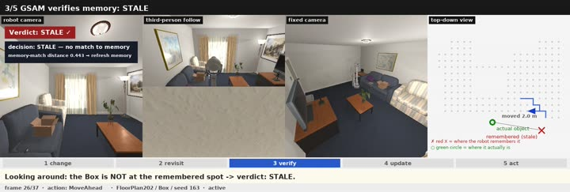</a>
  <a href="videos/m2_reliability_Box_163_baseline.mp4">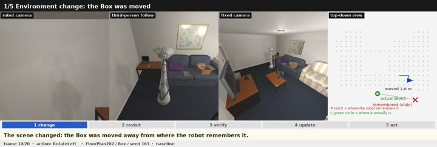</a>
</p>

---

## Highlights

| Result | Setting | Numbers |
|---|---|---|
| **Paired passive-vs-active challenge** | Pre-registered, geometry-screened AI2-THOR challenge (36 frozen cases / 32 evaluable pairs; corrected interaction protocol) | Active verify–update–act **29/32 (91%)** vs. live passive stale-memory **0/34**; McNemar exact two-sided **p = 3.7e-09** |
| **Held-out replication** | Unseen scenes, target classes, and seeds (11-case pilot and 24-case v2) | Active **11/11** vs. passive **0/11** (p = 9.8e-04) and active **22/24** vs. passive **0/24** (p = 4.8e-07) |
| **Stratified evaluation** | Below the challenge screen (47-case frozen stratum) and a screened-list re-run under one protocol | Below threshold: active **38/41** vs. passive **19/41** (p = 2.1e-05); screened re-run: **33/36** vs. **0/36** (p = 2.3e-10); repeat runs reproduce |
| **Live closed-loop detector** | 30 controller-backed rows with live `InitialRandomSpawn`, no `TeleportObject` | **22/30** agreement with offline labels; 20/30 memories mutated; non-uniform expected verification value (mean 0.7287) |
| **Stepwise task loop (no teleport shortcut)** | Fixed 6-case mixed challenge | Adaptive route-aware action budget lifts downstream `PickupObject` success from **2/6 → 6/6** |
| **VLM diagnostic baseline** | Qwen3-VL-32B on raw before/after frames | Staleness detection **6/6**, correct update **3/6**; multi-round agent completes **0/6** full chains |

These are **fixed-challenge mechanism** results with explicit boundaries (see
[Scope and limitations](#scope-and-limitations)); they are not broad-scale,
ObjectNav/SPL, or manipulation-benchmark claims.

---

## Results

### 1. Active maintenance beats passive retention on a pre-registered paired challenge

Each challenge case is a geometry-screened AI2-THOR rearrangement pair where a *passive* agent
acting on stale memory is forced to a far, wrong location (`d_passive >= 2.0m`) while an *active*
agent that verifies and refreshes can reach a nearby correct one (`d_active <= 1.5m`). All 36
qualifying cases were frozen before either arm ran.

- **Active arm:** 29 successes / 32 evaluable pairs (91%)
- **Live passive arm:** 0 successes / 34 rows (honest interaction, `forceAction=False`)
- **Paired exact test:** McNemar two-sided **p = 3.7e-09**; 95% Clopper-Pearson CI for the active arm [0.75, 0.98]
- 2 active rows were not evaluable (detector false negatives) and 2 frozen cases were lost to a
  simulator crash; both are reported, not excluded.

**Protocol correction.** An initial honest-interaction sweep faced targets with an incorrect yaw
formula and under-reported active success (22/34). The corrected protocol fixes the facing angle,
extends the camera-horizon sweep, and adds a bounded three-pose approach fallback for the active
arm; the archived pre-fix numbers are kept only as a development reference.

Artifacts: `results/0514_corrected_interaction_v1/`, `results/0514_paired_hard_challenge_screen_v1/`.

### 2. Held-out replication on unseen scenes, targets, and seeds

Two held-out challenges reuse the frozen protocol but unseen scenes (no FloorPlan1/3/201), unseen
target classes (no Apple/Book/Cup/Newspaper/Pencil), and unseen seeds. The pilot froze 11 cases;
the larger v2 froze 24 cases across six unseen scenes and eight unseen scene-target combinations,
using a disclosed richer before-state probe.

- **Held-out pilot:** active **11/11** vs. passive **0/11** (McNemar exact p = 9.8e-04)
- **Held-out v2:** active **22/24 (92%)** vs. passive **0/24** (McNemar exact p = 4.8e-07;
  95% CI for the active arm [0.73, 0.99])
- The 2 remaining active failures are occluded targets that stay invisible even after the approach
  fallback; they are reported, not excluded.

Artifacts: `results/0514_corrected_interaction_v1/holdout_v1_active/`,
`results/0514_corrected_interaction_v1/holdout_v2_active/`.

### 3. A live, controller-backed closed-loop detector

In a 30-row sweep the only policy-side staleness detector is a Grounded-SAM2 verifier running
after a live `InitialRandomSpawn`; oracle metadata is used **only** for offline labels. Detector
agreement with offline labels is **22/30 (0.7333)** with non-uniform expected verification values,
and 20/30 stale rows trigger a within-session memory refresh.

Artifacts: `results/ai2thor_live_gsam_closed_loop_post_05822d3/`,
`results/ai2thor_live_gsam_closed_loop_compare/`.

### 4. The full verify–update–act loop without navigation shortcuts

On a frozen 6-case mixed challenge, an adaptive, route-length-aware action budget converts a
stepwise (non-`TeleportFull`) loop from 2/6 to **6/6** downstream `PickupObject` successes, with
memory refreshed from detector evidence before acting.

Artifacts: `results/ai2thor_live_gsam_mixed_challenge_budgetfix_v1/`,
`results/ai2thor_live_gsam_complete_closed_loop_seed29_apple_v1/`.

### 5. Detection is not maintenance (VLM baseline)

A vision-language model (Qwen3-VL-32B) judged staleness correctly on all 6 mixed-challenge cases
from raw frames, but chose the wrong update direction on 3/6 — small/occluded objects were
declared "keep" because they were invisible from the changed viewpoint. A multi-round VLM agent
completed 0/6 full chains. This separates *detection* from *maintenance* and motivates the
verify–update–act loop.

Artifacts: `results/vlm_agent_multi_round_v1/`.

### 6. Reliability-aware maintenance: repairing a verifier false-negative mode (Phase 3)

A detector false negative can silently disable maintenance. On two Box cases the Grounded-SAM2
verifier returns a confident "fresh" verdict while the target instance is invisible, because a
detection lands near the remembered location's image projection — the failure mode that
drops downstream success to the passive baseline.

- **Failure mode:** 4/181 verified rows are false negatives, concentrated in confusable classes
  (Book 2/4, Box 2/8); the mode has a clean signature (no target in the revisit sweep; nearest
  detection below matched-distance 0.05).
- **Mechanism:** on a "fresh" verdict for a suspicious case, re-observe from up to two alternate
  poses and adopt the first stale re-verdict (default-off flag; zero false triggers observed).
- **Pre-registered randomized replication (30 rounds x 3 arms, 90 sessions, zero failures),
  analyzed at the randomized-session level:** the armed trigger recovers every observed pattern
  event, conditional on the pattern appearing — **8/8** pattern-present sessions vs **0/12**
  disarmed (session-level Fisher exact **p < 1e-5**); paired case success **60/60 vs 48/60**
  with the gain concentrated in **6 of 30** sessions (round-level paired randomization
  **p = 0.032**, cluster bootstrap 95% CI [6.7, 36.7] points), falling to **36/60** in the
  disarmed ablation.
- **Class-agnostic variant:** a near-match trigger that uses no per-class calibration recovers
  **10/10** events over 15 further rounds with a deliberately absent class-floor table — when the
  signature occurs.
- **Occurrence boundary (honest negative):** baseline elicitation outside the original pair — 30
  sessions on an independently screened new Box pair, 60 case-instances across six further Box
  seeds, and 72 Book sessions across three stack configurations — produced **no further
  occurrences** of the signature, so we do not claim it generalizes to new cases or classes.

Artifacts: [`results/phase3/`](results/phase3/) (summaries + frozen schedules) ·
Demos: [failure mode](videos/m2_reliability_Box_163_baseline.mp4) ·
[recovery](videos/m2_reliability_Box_163_active.mp4) (seed-191 copies alongside).

### 7. What the budget buys, and its limits (Phase 3)

- **Diagnosis:** on 2,281 decision-point records, staleness is near-deterministic by object
  category under randomized spawn (static fixtures 0.00 vs movable objects 0.88–1.00 per-type
  rates; type-only CV AUC 0.996). Calibrating P(stale) is saturated; the deployment-relevant
  uncertainty is the verifier.
- **Selection:** on a frozen 97-key mixed set at one verification per case, the deployed
  expected-value ranking selects the stale target **72.2%** vs **61.9%** for a uniform order
  (McNemar p = 6.3e-3); a reliability-first ranking is harmful (**38.1%**).
- **Static-signal saturation:** five model families over policy-visible signals (logistic,
  random forest, gradient boosting, pairwise logistic, calibrated GBM) reach **0.66–0.73**
  top-1 under identical leave-scene-out folds, none materially above the deployed **0.72**
  (key-level bootstrap CIs include zero) — the remaining selection headroom is near-saturated
  across the tested static families (not an impossibility result for all static policies).
- **Budget scaling:** two verifications per case reach **94.8%** selection and **76.3%** success,
  within 3.1 points of the no-constraint ceiling (**79.4%**, which is interaction-limited).
- **Observation limit:** targets are visible from the spawn pose after the change in only
  **2/30** keys (6.7%), so remote "glance-first" verification cannot carry the workload.

Artifacts: [`results/phase3/`](results/phase3/).

### 8. The advantage is not an artifact of the challenge screen (stratified evaluation)

The screened challenge forces passive failure by construction (`d_passive >= 2.0 m`). Two
additional frozen evaluations test what happens without that screen, both under the corrected
honest-interaction protocol and one machine:

- **Screened-list re-run (same protocol):** active **33/36** vs passive **0/36**, exact McNemar
  **p = 2.3e-10**; the entire 36-case list is evaluable.
- **Below-threshold stratum (47 frozen cases, `d_passive < 2.0 m`; 41 evaluable):** passive keeps
  non-trivial success — **19/41 (46%)** — so the screen was what made it fail outright; yet the
  active arm still wins **38/41 (93%)**, with **20 active-only vs 1 passive-only** discordant
  pairs (exact McNemar **p = 2.1e-05**). Six active rows are detector false negatives (the same
  mode as Section 6) and are not evaluable.
- **Repeat runs** of both strata reproduce the tables (33/36 and 37/41), so the result is
  session-level reproducible.

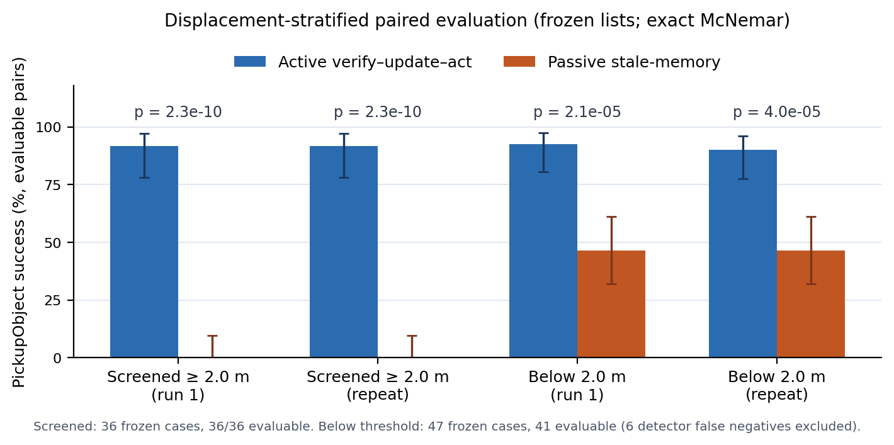

Artifacts: [`results/phase3/`](results/phase3/) (`stratified_*.json`).

### Figures

| Budget / verification-value curve | Component ablation | Mixed-challenge progression |
|---|---|---|
| 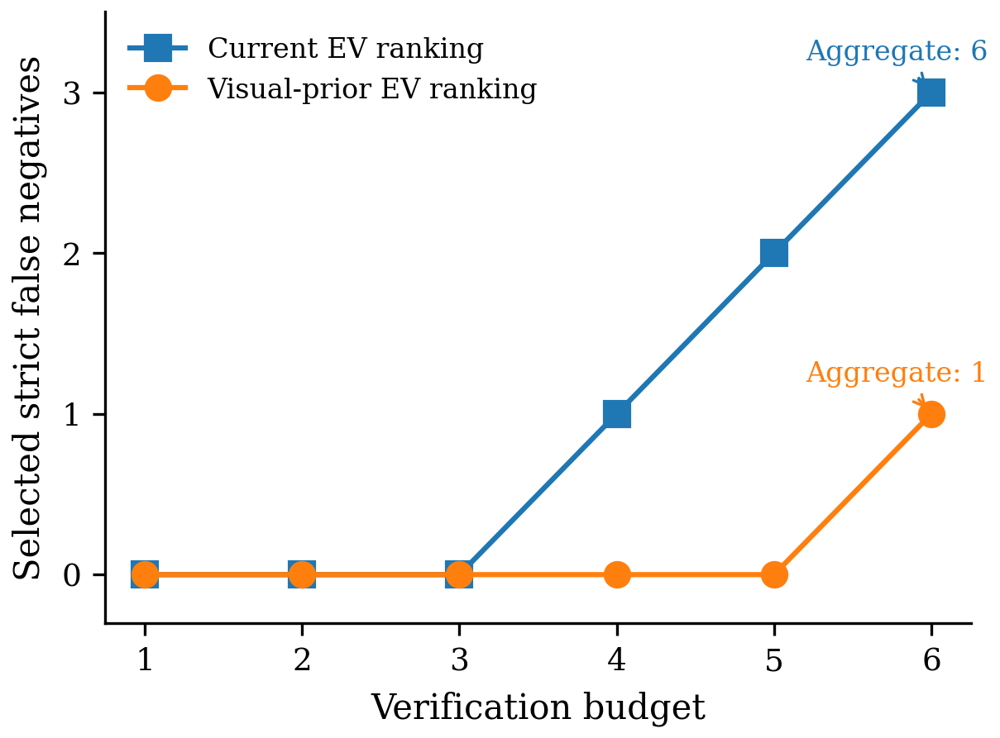 | 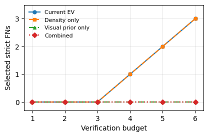 | 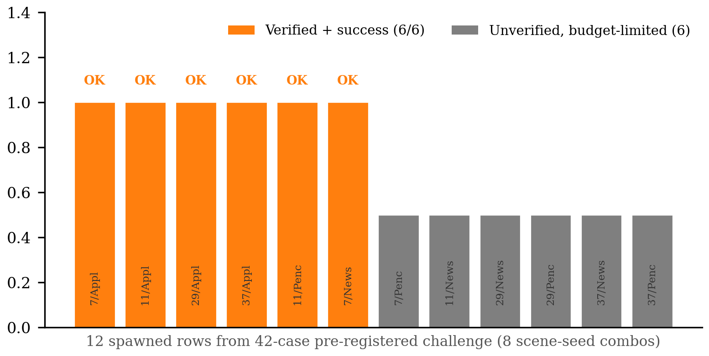 |

| Phase 3: study map with embedded evidence | Verifier failure-mode signature & intervention | Allocation and budget scaling |
|---|---|---|
| 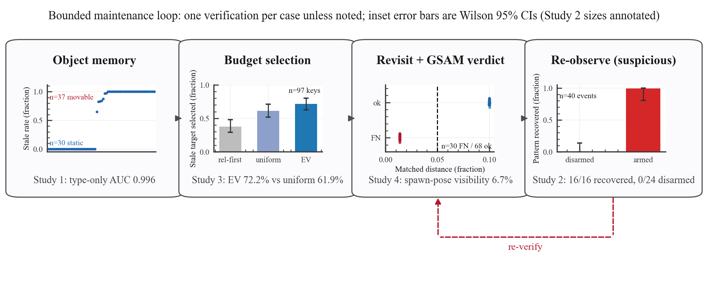 | 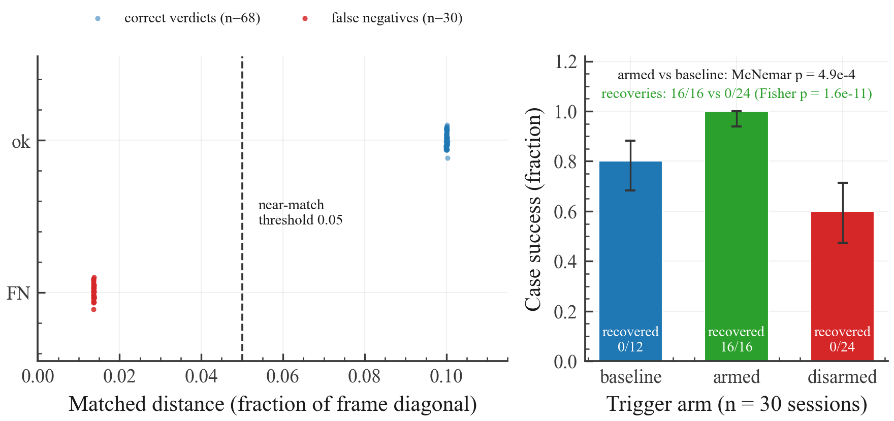 | 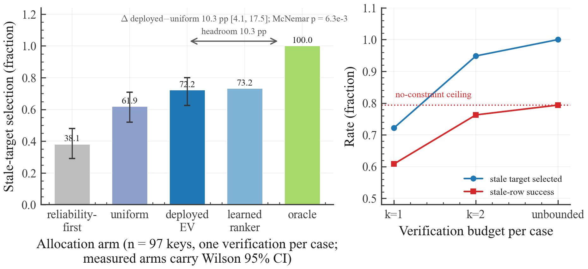 |

---

## Repository layout

```
embodied_memory_pilot/        # core library: benchmarks, verifiers, live closed-loop runners
  ai2thor_*.py                #   probes, paired-challenge screening, live GSAM loops, paired control
  *_verifier.py               #   oracle / MLP / CLIP / Grounded-SAM2 staleness verifiers
  maintenance / stress        #   proactive-maintenance policies and controlled stress tests
tests/                        # unit tests (verifier schemas, budgets, honest interaction, screening)
scripts/                      # batch run / analysis / demo helpers
  make_demo_video.py           #   render captioned two-panel demo videos
  analyze_paired_hard_challenge.py  # paired statistics, exact tests, Clopper-Pearson intervals
figures/                      # paper-ready figures (PNG)
videos/                       # demo videos (mp4) and the README GIF
results/                      # curated evidence artifacts (JSON/CSV/MD + selected frames)
run_b3_remaining_seeds.sh     # batch reference for the seed sweep
```

## Reproducing

The AI2-THOR experiments use a dedicated conda environment.

```bash
conda create -n memoryguard-ai2thor python=3.11 -y
conda activate memoryguard-ai2thor
pip install -r requirements.txt     # plus Grounding DINO and SAM 2 from their upstream repositories

# unit tests
python -m unittest discover -s tests

# live AI2-THOR closed-loop detector sweep (needs a GL-capable display, e.g. Xvfb)
conda run -n memoryguard-ai2thor python -m embodied_memory_pilot.ai2thor_live_gsam_closed_loop \
    --out-dir results/ai2thor_live_gsam_closed_loop

# paired passive-vs-active challenge: screen, run both arms, analyze
conda run -n memoryguard-ai2thor python -m embodied_memory_pilot.ai2thor_paired_hard_challenge_screen \
    --scene-targets FloorPlan2:Egg FloorPlan5:Bread --seeds 101 103 107 --k 4 \
    --freeze-mode round_robin --probe-mode rich --out-dir results/screen

conda run -n memoryguard-ai2thor python -m embodied_memory_pilot.ai2thor_live_gsam_closed_loop \
    --scenes FloorPlan2 FloorPlan5 --seeds 101 103 107 \
    --case-list results/screen/case_list_paired_hard_challenge_frozen_v1.json \
    --verification-budget 4 --revisit-mode stepwise --execute-task-bridge \
    --honest-interaction --max-alternate-poses 3 --rich-before-probe --out-dir results/active

conda run -n memoryguard-ai2thor python -m embodied_memory_pilot.ai2thor_paired_task_bridge_control \
    results/active/live_gsam_closed_loop.json --live-passive --honest-interaction --out-dir results/paired

python scripts/analyze_paired_hard_challenge.py --active results/active/live_gsam_closed_loop.json \
    --paired results/paired/paired_task_bridge_control.json \
    --case-list results/screen/case_list_paired_hard_challenge_frozen_v1.json --out-dir results/analysis

# render a demo video for a recorded case
python scripts/make_demo_video.py --row-source results/active/live_gsam_closed_loop.json \
    --case FloorPlan2:Potato:101 --mode active --out-dir videos
```

## Scope and limitations

This repository intentionally ships **bounded, auditable claims**. In particular, it does **not**
claim:

- broad scale or statistical robustness beyond the exact paired test;
- full navigation success rate or SPL (`TeleportFull` is used as a bounded revisit shortcut in
  parts of the live pipeline; stepwise variants are labeled as such);
- manipulation-benchmark performance or task success beyond the fixed challenges reported here;
- persistent memory writeback or cross-platform (Habitat/Gibson) transfer;
- active-over-passive superiority outside the frozen case universes (the stratified evaluation
  extends the comparison below the displacement screen — 38/41 vs 19/41 — but remains
  fixed-universe, single-machine, and session-level).

Oracle simulator metadata is used **only** for case construction and offline evaluation — never as
a policy input, ranking feature, or deployable detector.

## Citation

If you use MemoryGuard in your research, please cite this repository:

```bibtex
@misc{jiang2026memoryguard,
  title        = {MemoryGuard: Bounded Active Memory Maintenance for Long-Horizon Embodied Agents},
  author       = {Jiang, Xinyu},
  year         = {2026},
  howpublished = {\url{https://github.com/Jxy-yxJ/MemoryGuard}},
  note         = {Open-source research software}
}
```

## Author

**Xinyu Jiang** ([@Jxy-yxJ](https://github.com/Jxy-yxJ))
